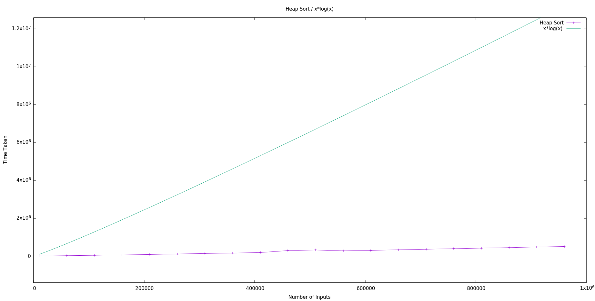
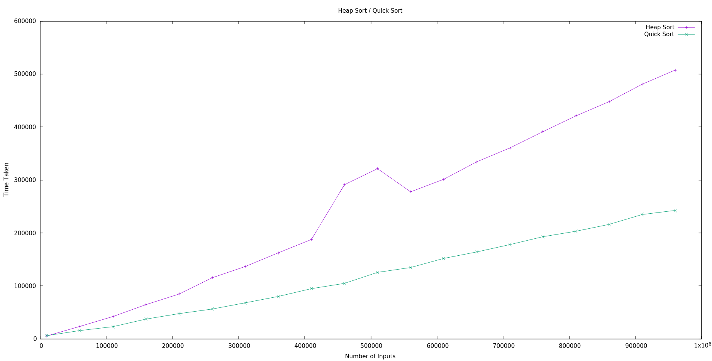
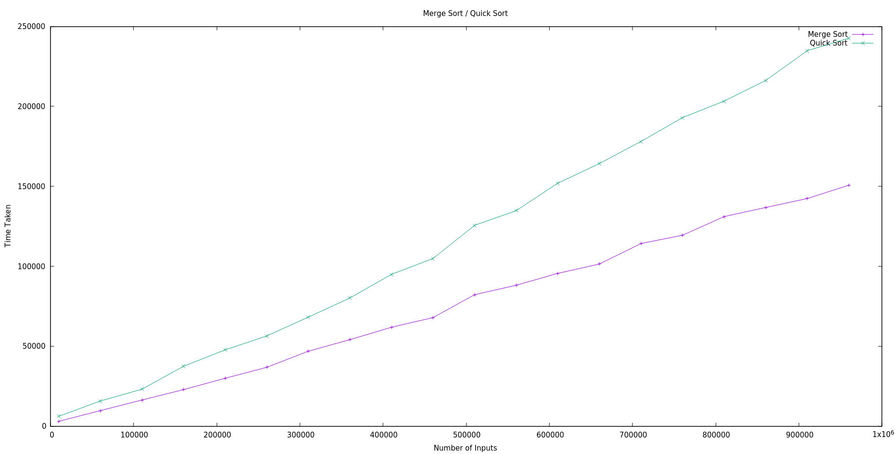
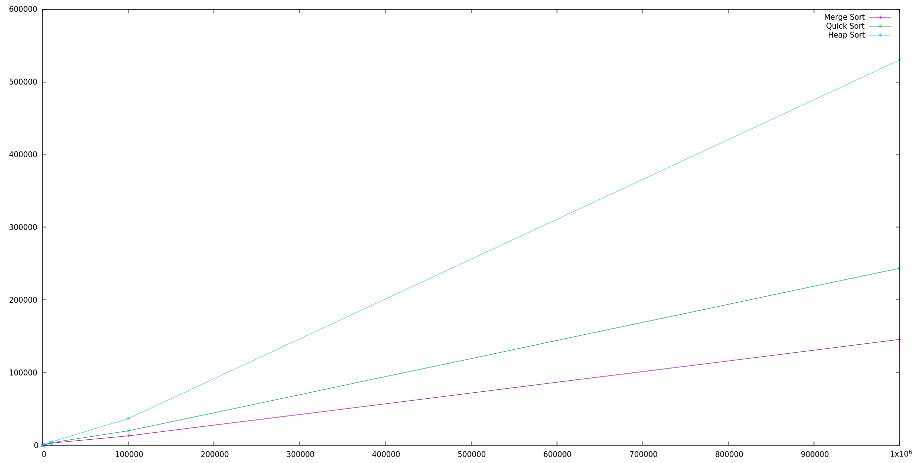
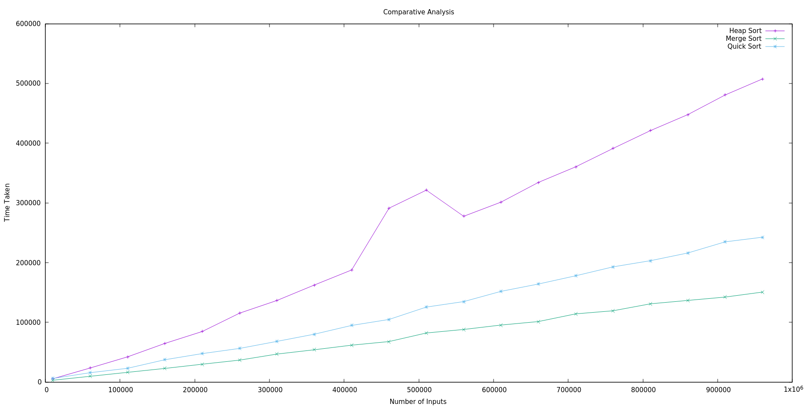

<h1> Merge Sort</h1>

 
 
 

<h1> Heap Sort</h1>

 
 
 

<h1> Quick Sort</h1>

 
 
 

<h1> Merge and Heap Sort Comparison </h1>

 
 
 

<h1> Heap And Quick Sort Comparison </h1>
 

 
 
 

<h1> Quick and Merge Sort Comparison </h1>
 

 
 
 

<h1>Overall Comparison </h1>
 

 
 
 

<h1>Overall Comparison over a Range (10000 - 1000000) </h1>
 

