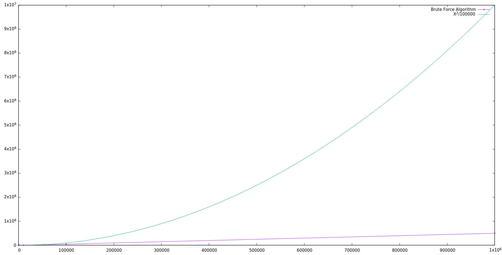

# 2-D Maxima

>## Brute Force Algorithm

 
 
 

 
 
 

>Time required by the algorithm depeding upon the length of dataset compared with (X^2)/100000

 
 

 
 
 

>## Plane Sweep Algorithm

 
 
 

 
 
 

>Time required by the algorithm depeding upon the length of dataset compared with (X)*(log(X))

 
 

 
 
 

>## Comparative Plot over a range (10000-1000000)

 
 
 

